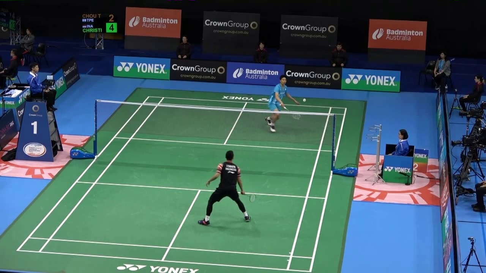

The implementation for the _**"TBNet: Real-time temporal and spatial video analysis of badminton"**_ 

---

## Demo


the red dots represent the badminton positions detected by TBNet, the blue flashes indicate a hit, and the red flashes signify that the shuttlecock has landed.

## 1. Features
- [x] Ball detection global stage

   
- [x] Ball detection local stage

  > (Using a fully connected layer at the end of the encoder to classify and output coordinates )
  >
  > **Experiments have shown that reducing the number of network layers may prevent the network from detecting the badminton shuttlecock; however, using local stage detection enables the network to detect the shuttlecock.**
  >
  > 
  

- [x] Hit detection

- [x] [Distributed Data Parallel Training](https://github.com/pytorch/examples/tree/master/distributed/ddp)

- [x] Smooth labeling for training

  > 
  >
  > Since the speed of the badminton shuttlecock changes most significantly before and after the hit, this project does not use all frames for training. Instead, we select a window size of 9 frames with a stride of 1, moving 4 or 8 frames before and after the hit occurs.

- [x] TensorboardX

  

- **achieve _95 FPS_ in the inference phase on a single GPU (GTX1080Ti). <br>**

- **acc—87.5%**

## 2. Getting Started
### Requirement

```shell script
pip install -U -r requirement.txt
```

You will also need PyTurboJPEG:

```shell script
$ sudo apt-get install libturbojpeg
...
$ pip install PyTurboJPEG
...
```

Other instruction for setting up virtual environments is [here](https://github.com/maudzung/virtual_environment_python3)

### 2.1. Preparing the dataset
The instruction for the dataset preparation is [here](./prepare_dataset/README.md)

### 2.2. Model 

**TBNet model architecture**:


### 2.3. How to run

#### 2.3.1. Training
##### 2.3.1.1. Single machine, single gpu

```shell script
python main.py --gpu_idx 0
```

##### 2.3.1.2. Multi-processing Distributed Data Parallel Training
We should always use the `nccl` backend for multi-processing distributed training since it currently provides the best 
distributed training performance.

- **Single machine (node), multiple GPUs**

```shell script
python main.py --dist-url 'tcp://127.0.0.1:29500' --dist-backend 'nccl' --multiprocessing-distributed --world-size 1 --rank 0
```

- **Two machines (two nodes), multiple GPUs**

_**First machine**_

```shell script
python main.py --dist-url 'tcp://IP_OF_NODE1:FREEPORT' --dist-backend 'nccl' --multiprocessing-distributed --world-size 2 --rank 0
```
_**Second machine**_

```shell script
python main.py --dist-url 'tcp://IP_OF_NODE2:FREEPORT' --dist-backend 'nccl' --multiprocessing-distributed --world-size 2 --rank 1
```

#### 2.3.1. Training with config

- Train the global and  local  with 30 epochs

```shell script
./train_1st_phase.sh
```


#### 2.3.3. Visualizing training progress
The Tensorboard was used to save loss values on the training set and the validation set.
Execute the below command on the working terminal:
```
    cd logs/<task directory>/tensorboard/
    tensorboard --logdir=./
```

Then open the web browser and go to: [http://localhost:6006/](http://localhost:6006/)


#### 2.3.4. Evaluation

```shell script
./test.sh
```

#### 2.3.5. Demo:

Run a demonstration with an input video:

```shell script
./demo.sh
```


TBC~~~~~~~~~~~~
